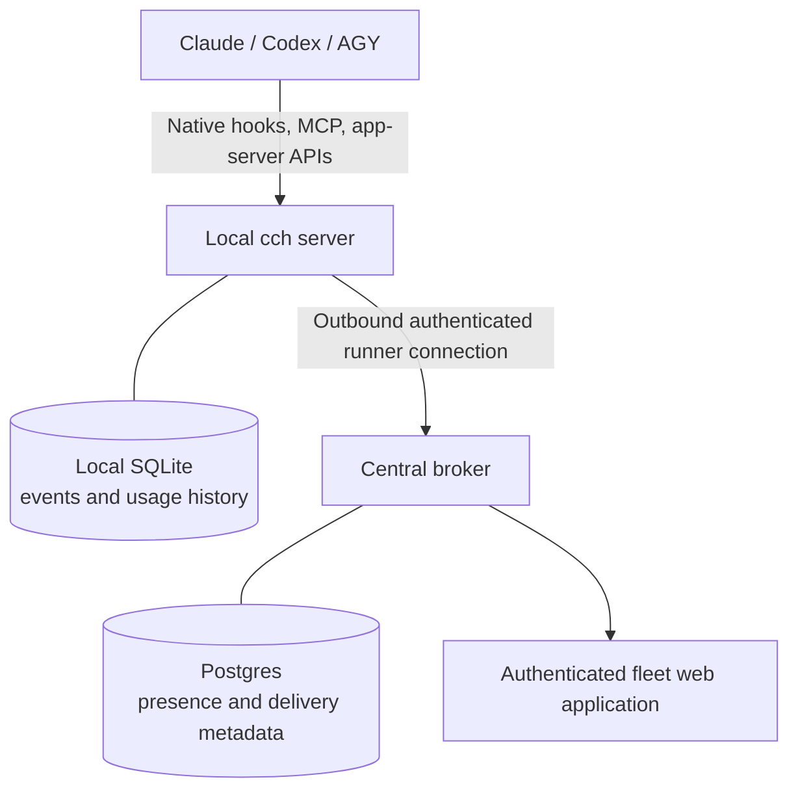

# cch — Common Craft Hall

**A local-first control plane for collaborating coding agents.**

cch discovers and coordinates native Claude Code and Codex sessions across one
or more machines, and incorporates supported AGY lifecycle and usage
observations. Execution, credentials, transcripts, approvals, and terminal
control remain with each provider's native runtime.

The project began as a Claude Code hook framework. Hooks remain a first-class
capability, but they are now one part of a broader system for agent presence,
ordinary-text routing, execution events, and shared usage forecasts.

## What cch does

- Registers live native agent sessions automatically.
- Gives sessions readable names while routing by opaque identifiers.
- Sends ordinary text between supported agents on the same or different
  paired runners.
- Opens a provider's exact native session URL when the provider advertises one.
- Presents runner-local events, hooks, and usage in one web application.
- Presents fleet-wide agents, normalized activity, and usage in an authenticated
  operator application.
- Keeps raw provider data local unless a deliberately normalized observation is
  part of the fleet contract.

cch is not an agent runtime, terminal proxy, transcript store, or provider
credential broker. If the control plane is unavailable, native agents continue
to run locally.

## Architecture at a glance



Each machine is a **runner**. A runner discovers its local sessions and makes
only sanitized presence and supported observations available to the broker.
Messages are leased to a destination runner, delivered through the provider's
native input mechanism, acknowledged idempotently, and not retained as durable
message bodies.

See [ARCHITECTURE.md](ARCHITECTURE.md) for the system boundaries and
[the proof-of-concept record](docs/native-control-plane-poc.md) for the tested
Claude/Codex vertical slice.

## Quick start

### Prerequisites

- JDK 21+
- [Clojure CLI](https://clojure.org/guides/install_clojure) (`clj`)
- SQLite
- At least one supported provider CLI

### Install the local application

```bash
git clone <repository-url> cch
cd cch
just build
scripts/install
cch init
cch install --all
cch control install
cch install-service
# Run the OS activation command printed by cch install-service.
```

`cch install --all` detects available providers and installs cch-owned lifecycle
observation entries. `cch control install` adds automatic Claude/Codex session
registration and their narrowly scoped MCP routing tools. Neither command
enables a provider's proprietary Remote Control feature, copies provider
credentials, or requires per-session pairing.

Open the runner-local application at `http://127.0.0.1:8888/` after starting
the installed service. Fleet operation additionally requires a deployed broker
and a one-time runner pairing; deployment credentials and machine identities do
not belong in this repository.

## Command surface

| Command | Purpose |
|---------|---------|
| `cch init` | Initialize local state and project configuration |
| `cch install --all` | Provision every supported provider found on this runner |
| `cch uninstall` | Remove cch-owned provider configuration |
| `cch list` | List built-in hooks and their state |
| `cch log` | Query local execution events |
| `cch attention` | Report time agents spent waiting for the operator |
| `cch doctor` | Check local provider observation wiring |
| `cch control install` | Install automatic session registration and routing tools |
| `cch control pair` | Persist a one-time runner credential and install its service |
| `cch control sessions` | List sanitized native session presence |
| `cch control send` | Send ordinary text to a registered session |
| `cch control doctor` | Check pairing, supervision, and native capabilities |
| `cch serve` | Run the local dispatcher and web application |
| `cch install-service` | Install OS-native supervision for the local server |
| `cch control broker` | Run the central broker (Postgres-backed) |
| `cch install-broker-service` | Install a systemd user unit for the broker |

Run `cch <command> --help` or `cch control --help` for details.

## Deploy the broker

Fleet operation needs one broker reachable by every paired runner. It is the
same artifact as everything else — `cch control broker` — configured entirely
through environment variables, so the repository ships the generic deploy
primitives while your secrets and host identities stay out of it.

1. Provide configuration. Copy
   [`resources/cch-control-broker.env.example`](resources/cch-control-broker.env.example)
   to `~/.config/cch-control-broker.env` and fill in the Postgres connection,
   the accepted runner tokens, and (optionally) the Cloudflare-Access web
   switchboard. Every variable the broker reads is documented there.

2. Pick a supervision path:
   - **Runtime + systemd** (simple hosts): `cch install-broker-service`
     (optionally `--host`/`--port`), then run the printed
     `systemctl --user enable --now cch-control-broker`.
   - **Container** (isolated server deploys): build the image from the
     [`Containerfile`](Containerfile) and run it with the broker subcommand;
     [`resources/service/cch-control-broker.container`](resources/service/cch-control-broker.container)
     is a hardened podman Quadlet to install under
     `~/.config/containers/systemd/`.

3. Verify `http://<host>:<port>/health` reports `status: ok` and the expected
   runner count, then complete `cch control pair` on each runner.

Both paths read the same env file, so an environment-specific wrapper only has
to supply that file and choose a path.

## Hooks and observations

Hooks are local policy and observation functions. They run inside the long-lived
cch server, so a JVM is not started for every provider event.

Built-in examples include:

| Hook | Role |
|------|------|
| `scope-lock` | Ask before editing outside the configured worktree scope |
| `protect-files` | Deny edits to configured sensitive files |
| `command-guard` | Apply command policy before shell execution |
| `push-gate` | Run configured quality gates before an agent pushes |
| `context-governor` | Observe and manage context pressure |
| `event-log` | Record supported lifecycle events locally |

Hook policy is configured globally in `~/.config/cch/config.yaml` or per project
in `.cch-config.yaml`:

```yaml
hooks:
  scope-lock:
    allowed-paths:
      - src/
      - test/
  push-gate:
    gates:
      - just lint-all
      - just test
```

Provider lifecycle payloads may include prompts, commands, paths, and other
sensitive data. The complete event log stays in the runner's local SQLite
database. Fleet federation publishes purpose-built activity and usage
observations rather than copying the raw event tables.

## Native authority and security boundaries

- Provider logins remain on the runner that executes the provider CLI.
- cch accepts ordinary text for agent-to-agent routing, not terminal input,
  approval decisions, commands, or credentials.
- Runners authenticate to the broker with one-time machine pairing credentials;
  starting an agent does not create another login chore.
- The hosted operator application has a separate human authentication boundary.
- Broker storage contains presence, delivery state, aliases, and normalized
  observations; it is not the source of truth for native session history.
- Exact session URLs link back to native provider interfaces for transcripts,
  approvals, and richer control.

## Repository-name migration

The project and repository were formerly named `claude-code-hooks`. The CLI,
configuration directory, data directory, service names, and Clojure namespaces
were already `cch`, so no local state migration is required.

For an existing checkout:

```bash
git remote set-url origin git@github.com:<owner>/cch.git
# Renaming the checkout directory is optional. If you do, refresh installed links:
scripts/install
```

Existing Beads issue identifiers retain their historical prefix. They are
stable record identifiers, not the current product name.

## Development

```bash
just test
just lint-all
clj -M:cli --help
```

This is a public repository. Tests, fixtures, documentation, issue records, and
commit messages must use synthetic identities, hosts, paths, URLs, and secrets.
